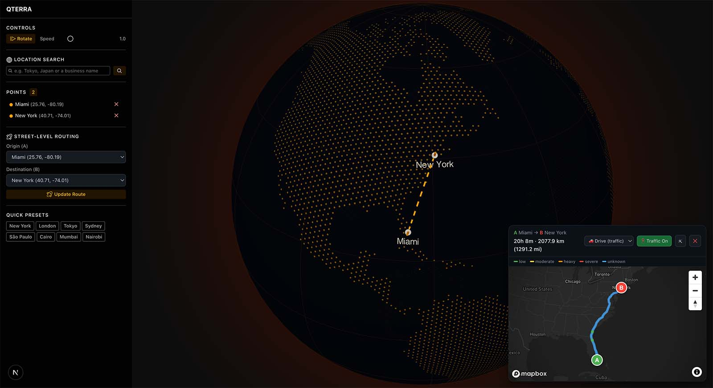
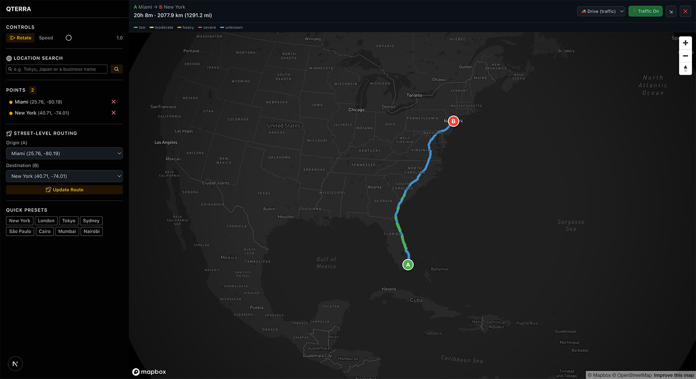

# Qterra

**Qterra** is an interactive 3D globe explorer built with Next.js. Search for any location in the world, pin it on a rotating globe, draw animated arcs between points, and instantly pull up a real-time street-level route between two pins — complete with live traffic congestion colouring.

---

## Features

- **Interactive 3D Globe** — rendered with Three.js and `three-globe`, featuring a dark vector polygon aesthetic with a glowing amber atmosphere.
- **Location Search** — type any city, address, or landmark and drop a pin directly on the globe. Powered by Google Maps Geocoding (with automatic MapQuest fallback).
- **Animated Arcs** — sequential pins are connected with animated dashed arcs on the globe surface.
- **Camera Fly-To** — clicking a pinned location smoothly animates the camera to that point on the globe.
- **Route Map Overlay** — select two pins as origin and destination to reveal a Mapbox street-level map overlay showing the turn-by-turn route.
- **Live Traffic Congestion** — route segments are colour-coded by congestion level (green → yellow → orange → red).
- **Transport Modes** — switch between driving (with traffic), driving (without traffic), walking, and cycling.
- **Route Stats** — displays total distance (km / mi) and estimated travel time.
- **Auto-Rotation** — the globe auto-rotates on load; pause/resume with a button and adjust speed with a slider.
- **Token Security** — API keys are never exposed in source code; Mapbox Directions requests are proxied through Next.js API routes so the secret key stays server-side.

---

## Screenshots





---

## Tech Stack

| Layer | Library / Tool |
|---|---|
| Framework | [Next.js 16](https://nextjs.org) (App Router) |
| Language | TypeScript 5 |
| 3D Rendering | [Three.js](https://threejs.org) + [React Three Fiber](https://r3f.docs.pmnd.rs) + [three-globe](https://github.com/vasturiano/three-globe) |
| Map Overlay | [Mapbox GL JS](https://docs.mapbox.com/mapbox-gl-js/) |
| UI Components | [Radix UI Themes](https://www.radix-ui.com/themes) + [Radix Icons](https://www.radix-ui.com/icons) |
| Styling | [Tailwind CSS v4](https://tailwindcss.com) |
| Geocoding | Google Maps Geocoding API (+ MapQuest fallback) |
| Directions | Mapbox Directions API (server-side proxy) |
| Local Database | [SQLite](https://sqlite.org) via [better-sqlite3](https://github.com/WiseLibs/better-sqlite3) |

---

## Prerequisites

- **Node.js** 18 or later ([download](https://nodejs.org))
- **npm** (comes with Node) or another package manager
- API keys for the services listed in [Environment Variables](#environment-variables)

---

## Getting Started

### 1. Clone the repository

```bash
git clone https://github.com/carlosjovi/qterra.git
cd qterra
```

### 2. Install dependencies

```bash
npm install
```

### 3. Configure environment variables

Copy the example file and fill in your API keys:

```bash
cp .env.example .env.local
```

Then open `.env.local` and add your keys (see [Environment Variables](#environment-variables) for where to get them).

### 4. Start the development server

```bash
npm run dev
```

Open [http://localhost:3000](http://localhost:3000) — you should see the globe.

---

## Environment Variables

All keys live in `.env.local`, which is **never committed** (covered by `.gitignore`). Use `.env.example` as a template.

| Variable | Required | Description |
|---|---|---|
| `NEXT_PUBLIC_MAPBOX_ACCESS_TOKEN` | **Yes** | Public Mapbox token (`pk.*`) — rendered in the client bundle for the map overlay. |
| `MAPBOX_ACCESS_TOKEN` | **Yes** | Secret Mapbox token (`sk.*`) — used server-side only for the Directions API proxy. |
| `GOOGLE_MAPS_API_KEY` | Recommended | Primary geocoder. Enables accurate search for addresses, cities, and landmarks. |
| `MAPQUEST_API_KEY` | Optional | Fallback geocoder if Google is unavailable or not configured. |

### Where to get each key

- **Mapbox tokens** → [account.mapbox.com/access-tokens](https://account.mapbox.com/access-tokens/). Create a *public* token and a separate *secret* token (grant it `styles:read` and `directions:read` scopes).
- **Google Maps API key** → [Google Cloud Console](https://console.cloud.google.com/). Enable the **Geocoding API** then create a restricted API key.
- **MapQuest API key** → [developer.mapquest.com](https://developer.mapquest.com/) — free tier available.

> **Note:** The app works without Google/MapQuest keys (geocoding simply returns no results). The route overlay requires both Mapbox tokens.

---

## Usage

1. **Search for a location** — type a city or address in the sidebar search box and press Enter or click the search button. The globe camera will fly to the pinned location.
2. **Add more pins** — repeat the search to add a second location. An animated arc is drawn between sequential pins.
3. **View a route** — once two or more pins are added, select an *Origin* and *Destination* from the dropdowns in the sidebar, then click **Get Route**. A Mapbox street-level map appears as an overlay panel.
4. **Switch transport mode** — use the mode buttons in the route overlay (car, car without traffic, walking, cycling) to re-fetch the route.
5. **Close the route** — click the × button in the route panel to dismiss it.
6. **Control the globe** — use the Pause / Rotate button and the Speed slider to control auto-rotation. Click and drag the globe to manually orbit.

---

## Project Structure

```
data/
└── README.md                   # Database docs (qterra.db is git-ignored)
src/
├── app/
│   ├── layout.tsx              # Root layout — Radix Theme, fonts
│   ├── page.tsx                # Main page — state orchestration
│   ├── globals.css             # Tailwind + global overrides
│   └── api/
│       ├── geocode/route.ts    # Server-side geocoding proxy
│       ├── directions/route.ts # Server-side Mapbox Directions proxy
│       └── places/
│           ├── route.ts        # Google Nearby + Place Details proxy
│           └── photo/route.ts  # Google Places photo proxy
├── components/
│   ├── Globe.tsx               # Three.js / three-globe canvas component
│   ├── CoordinatePanel.tsx     # Sidebar: search, pin list, route controls
│   └── MapboxRouteMap.tsx      # Mapbox GL overlay with route + congestion
└── lib/
    ├── db.ts                   # SQLite database layer (caching + persistence)
    └── types.ts                # Shared TypeScript interfaces
```

---

## Local Database

Qterra automatically caches every API response in a local SQLite database (`data/qterra.db`). This gives you:

- **Recent searches** — all geocoding queries are stored and queryable.
- **Saved locations** — place details and photos are persisted locally.
- **Offline dev / mock data** — once you've fetched data, you can work without hitting external APIs.
- **Photo caching** — place photos are served from the local DB on repeat requests, saving Google API quota.

The database file is **git-ignored** — only the `data/README.md` with schema documentation is committed. The DB is created automatically on the first API call; no manual setup is needed.

See [data/README.md](data/README.md) for the full schema reference and inspection tips.

---

## Available Scripts

| Command | Description |
|---|---|
| `npm run dev` | Start the development server at `http://localhost:3000` |
| `npm run build` | Build the app for production |
| `npm run start` | Start the production server (requires `build` first) |
| `npm run lint` | Run ESLint across the codebase |

---

## Deployment

The easiest way to deploy Qterra is [Vercel](https://vercel.com):

1. Push the repo to GitHub.
2. Import the project in the Vercel dashboard.
3. Add your environment variables in **Settings → Environment Variables**.
4. Deploy — Vercel handles the Next.js build automatically.

For other platforms (Netlify, Railway, Render, Docker, etc.) any host that supports Node.js and environment variables will work. Run `npm run build && npm run start` to serve the production build.

---

## Contributing

Contributions are welcome! To get started:

1. Fork the repository.
2. Create a feature branch: `git checkout -b feature/your-feature-name`
3. Commit your changes: `git commit -m "feat: describe your change"`
4. Push the branch: `git push origin feature/your-feature-name`
5. Open a Pull Request.

Please make sure `npm run lint` passes before submitting.

---

## License

This project is open-source and available under the [MIT License](LICENSE).